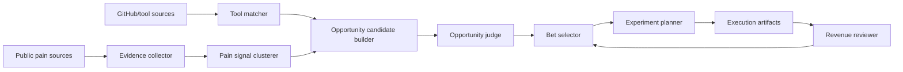

# Revenue Pipeline Design - 2026-06-01

## Application Overview

`openSource_scanner` should evolve from a repository scanner into a local-first revenue pipeline.

The user should picture it as a decision machine for a solo developer: it watches public pain signals and product/tool signals, filters them through a 2C/light-consumer lens, chooses one buildable revenue bet, and produces execution artifacts. The main users are the project owner and future coding agents. The system should reduce reading debt: a run that only creates more research without choosing a next action is considered incomplete.

The current code already scans GitHub repositories, scores them, stores them in SQLite, and writes Markdown reports/memos. The missing layer is the part that connects public pain evidence to a selected product experiment and a revenue review.

## Current Situation

Existing useful pieces:

- CLI entrypoint: `src/open_source_scanner/__main__.py`.
- GitHub connector with conservative request guards: `src/open_source_scanner/connectors/github.py`.
- SQLite storage for repository opportunities: `src/open_source_scanner/storage.py`.
- Basic scoring, taxonomy, reports, memos, feedback, and shortlist.
- Consumer direction docs: `docs/research/2026-05-20-solo-dev-2c-entertainment-pivot.md`.
- Current mainline decision: `.agent-context/decisions/DEC-2026-06-01-001-revenue-pipeline-mainline.md`.

Gaps:

- No durable model for community pain evidence.
- No model for source runs, cache, safety state, or evidence provenance.
- No first-class consumer scoring that combines pain, hook, distribution, monetization, and solo buildability.
- No mechanism that selects exactly one active bet.
- No experiment artifacts, metrics capture, or continue/kill/pivot review.
- Previous market-pain automation is intentionally inactive.

## Proposed Direction

Build the system in layers:



The design should keep source collection boring and conservative. The value is not aggressive scraping; the value is the judgment layer after collection.

## Research Basis

### Product Validation

- Jobs-to-be-Done is a useful lens because it asks what progress a user is trying to make in a real situation, not just what feature they say they want. Use it to turn forum posts into `audience + situation + struggle + desired progress`. Source: [Christensen Institute - Jobs to Be Done](https://www.christenseninstitute.org/theory/jobs-to-be-done/).
- MVP design should cut scope until the test answers one risky question. For this project, most experiments should test one of: hook clarity, willingness to try, willingness to pay, retention, or distribution response. Source: [Y Combinator - Practical Design for MVPs](https://www.ycombinator.com/blog/practical-design-mvp).
- The pipeline must avoid the "research trap": if a run ends with a pile of candidates but no selected action, the run failed its product purpose.

### Platform And Collection Boundaries

- GitHub has official REST API rate-limit headers and separate search limits; keep using explicit request budgets, spacing, and fail-closed behavior. Source: [GitHub REST API rate limits](https://docs.github.com/en/rest/using-the-rest-api/rate-limits-for-the-rest-api?apiVersion=2022-11-28).
- Hacker News has an official Firebase API for public stories, users, and item trees. This is a good low-risk source for Ask HN, Show HN, and Launch HN style signals. Source: [Hacker News API](https://github.com/HackerNews/API).
- V2EX has an official API help page. Treat it as a public-source collector with explicit limits and no private-account export. Source: [V2EX API Help](https://www.v2ex.com/help/api).
- Product Hunt API access is useful for structured launch data, but API availability, terms, and commercial use need explicit care. Prefer public pages/manual import until the exact usage is accepted. Source: [Product Hunt API v2 docs](https://www.producthunt.com/v2/docs).
- Chrome Web Store API is for publishing/managing extensions, not a general marketplace search API. Use it as a distribution/validation target, not a broad scraping source. Source: [Chrome Web Store API](https://developer.chrome.com/docs/webstore/api).
- Steamworks wishlists are a meaningful demand signal for game experiments once there is a Steam page, but Steam Store public pages should be touched gently and cached. Source: [Steamworks wishlists](https://partner.steamgames.com/doc/marketing/wishlist).
- For public web pages without stable APIs, respect robots.txt and use low-volume cached collection. Source: [RFC 9309 Robots Exclusion Protocol](https://datatracker.ietf.org/doc/rfc9309/).

## Non-Goals

- Do not build a general web crawler.
- Do not log in, export account data, collect private messages, or store unnecessary personal identifiers.
- Do not recreate `market-pain-radar` until the pipeline can choose and execute a bet.
- Do not optimize for B2B workflow, ERP, SaaS operations, compliance, procurement, sales-led onboarding, CRM, POS, accounting, or inventory.
- Do not optimize for GitHub stars alone.
- Do not let multiple product bets become active at the same time in V1.

## Core Workflow

### 1. Collect Evidence

Goal: gather public signals that suggest repeated frustration, desire, entertainment pull, or workaround behavior.

Inputs:

- Public community posts and comments.
- Public launch/showcase pages.
- Public game/tool discovery pages.
- Existing Markdown market-pain records.
- Existing GitHub opportunity rows.

Outputs:

- `EvidenceItem` rows with source, URL, title, summary, timestamp, language, and safety metadata.
- A run report showing sources touched, request counts, skipped sources, and safety decisions.

Rules:

- Store source URL and short summary, not full page dumps.
- Store quotes only when short and necessary.
- Redact handles unless the source identity is essential and public.
- Cache fetched URLs and avoid touching the same page repeatedly inside the configured TTL.
- Keep default runs small: 5-10 high-signal pages per source family, not broad crawling.

### 2. Extract Pain Signals

Goal: convert evidence into structured user situations.

Each `PainSignal` should answer:

- Who is affected?
- What situation are they in?
- What are they trying to do?
- What friction or desire appears?
- What workaround exists now?
- Why might this be current or repeated?

Use a deterministic V1 extractor:

- Keyword and phrase rules for consumer categories.
- Source-specific hints, such as `Ask HN`, `Show HN`, V2EX nodes, Reddit communities, Steam/itch tags.
- Manual-import summaries from Markdown records.

Do not require LLM summarization in V1. If an AI summarizer is added later, it must write auditable summaries that retain source links and confidence.

### 3. Match Tools And Repositories

Goal: find implementation accelerators, not final product decisions.

Tool matches can come from:

- Existing `opportunities` table.
- GitHub repository search.
- Known engines/templates/libraries from previous scans.

Each `ToolMatch` should capture:

- URL, license, stars, recency, language, setup friction, platform fit.
- Whether it is a product candidate, implementation reference, asset/template, or rejected tool.
- License caution and commercial-use notes.

### 4. Build Opportunity Candidates

Goal: turn pain clusters and tool matches into product-shaped hypotheses.

An `OpportunityCandidate` should contain:

- `thesis`: one-sentence product idea.
- `audience`: narrow first user group.
- `job_story`: situation, motivation, desired outcome.
- `hook`: what a user understands in 10 seconds.
- `prototype_scope`: what can be built in 7/14/30 days.
- `distribution_path`: where the first 100 users could come from.
- `monetization_path`: paid download, supporter pack, cosmetic pack, template, extension, subscription, donation, or preorder/wishlist.
- `tool_accelerators`: matching repositories or tools.
- `risks`: legal, IP, platform, scope, content burden, competition, generic-AI-wrapper risk.

### 5. Judge Candidates

The judge must be stricter than a normal report score. A high GitHub score is not enough.

Hard gates:

- Reject ERP and heavy B2B by default.
- Reject if no consumer-facing audience can be named.
- Reject if no first distribution channel can be named.
- Reject if the prototype cannot be reduced to a 14-day visible demo.
- Reject if the product depends on unauthorized IP/fandom assets.
- Reject if the idea is only "AI wrapper" with no entertainment, utility, creation, learning, or social loop.
- Reject if it needs multiplayer/live-ops/community moderation before validation.

Scoring dimensions:

| Dimension | Points | Meaning |
| --- | ---: | --- |
| Pain/desire evidence | 0-20 | Repeated public signals from multiple posts or platforms |
| Emotional pull / shareability | 0-15 | Users would show it, talk about it, or keep it open |
| 10-second hook | 0-15 | A screenshot/GIF/title explains the product fast |
| Solo buildability | 0-20 | 7/14-day prototype possible without a team |
| Distribution fit | 0-15 | Clear first channel: itch, Steam demo, Product Hunt, Reddit, V2EX, Chrome Web Store, Xiaohongshu, etc. |
| Monetization clarity | 0-15 | Obvious first price/test path |
| Tool acceleration | 0-10 | Existing repo/template materially reduces build time |
| Freshness | 0-10 | Recent signals or rising category |
| Competition wedge | 0-10 | Has a narrower angle than existing products |
| Risk penalty | -0 to -40 | Legal/IP/platform/scope/compliance/content burden |

Review passes:

- Optimist pass: why this could work.
- Skeptic pass: why this may be delusion.
- Operator pass: what must happen next week.
- Platform/legal pass: what cannot be collected, copied, or shipped.

### 6. Select One Bet

Goal: create one active bet, not a queue of exciting ideas.

Rules:

- If `bets/current.md` exists and status is `active`, new candidates go to `bets/backlog.md`.
- A new active bet can be selected only when there is no active bet or the current bet has been killed/paused.
- Selector should prefer confidence-adjusted expected value, not raw excitement.
- Selector must write explicit kill criteria before work begins.

Bet file shape:

```markdown
# Current Bet - <slug>

## Thesis
...

## First Audience
...

## Why Now
...

## Evidence
...

## 14-Day Experiment
...

## Success Criteria
...

## Kill Criteria
...

## Next Action
...
```

### 7. Plan Experiment

Goal: convert the active bet into concrete artifacts.

Experiment folder:

```text
experiments/YYYY-MM-DD-<slug>/
  plan.md
  demo-scope.md
  landing-copy.md
  distribution-posts.md
  metrics.md
  review.md
```

Default 14-day experiment:

- Day 1: sharpen thesis, target user, hook, and landing copy.
- Day 2-4: build or mock the smallest visible demo.
- Day 5: create screenshots/GIF/video.
- Day 6: post to one friendly channel.
- Day 7: review responses and decide whether to continue.
- Day 8-11: improve demo based on real friction.
- Day 12: run second channel test.
- Day 13: run willingness-to-pay test.
- Day 14: continue/kill/pivot review.

### 8. Revenue Review

Goal: decide what happens after an experiment, not just archive it.

Review inputs:

- Page views, demo clicks, downloads, wishlists, signups, comments, replies, saves, upvotes, purchases, preorder clicks, email replies.
- Qualitative signals: confusion, excitement, repeated requests, "I want this", "where can I buy", "does it work on X".
- Retention signals when available: D1 return, D7 return, background-open minutes, active interventions/hour.

Decision outputs:

- `continue`: enough signal to keep improving.
- `kill`: insufficient signal or fatal risk.
- `pivot`: same audience/pain, different hook or product shape.
- `defer`: useful but not now.

## Data Model

Add new tables instead of mutating `opportunities` heavily.

### `source_runs`

Tracks each collection/judgment run.

Fields:

- `id`
- `started_at`, `finished_at`
- `profile`
- `source_names_json`
- `status`: `ok`, `partial`, `failed`
- `safety_notes`
- `created_paths_json`

### `evidence_items`

Public source evidence.

Fields:

- `id`
- `source`: `github`, `hn`, `v2ex`, `reddit`, `itch`, `steam`, `product_hunt`, `chrome_web_store`, `manual`
- `source_type`: `community_post`, `comment`, `launch`, `store_page`, `repo`, `manual_note`
- `source_id`
- `url`
- `title`
- `summary`
- `language`
- `observed_at`
- `collected_at`
- `run_id`
- `raw_ref`
- `safety_flags_json`

Unique key: `(source, source_id)` when source IDs exist; otherwise normalized URL.

### `pain_signals`

Structured pain/desire clusters.

Fields:

- `id`
- `cluster_key`
- `audience`
- `situation`
- `struggle`
- `desired_progress`
- `current_workaround`
- `category`
- `confidence`
- `evidence_count`
- `last_seen_at`

### `pain_signal_evidence`

Many-to-many evidence links.

Fields:

- `pain_signal_id`
- `evidence_item_id`
- `relevance`
- `note`

### `tool_matches`

Implementation accelerators.

Fields:

- `id`
- `pain_signal_id`
- `source`
- `source_id`
- `url`
- `title`
- `license_spdx_id`
- `stars`
- `last_activity_at`
- `match_type`: `product_candidate`, `implementation_reference`, `template`, `asset`, `rejected`
- `fit_summary`
- `risk_notes`

### `opportunity_candidates`

Product hypotheses.

Fields:

- `id`
- `slug`
- `thesis`
- `audience`
- `job_story`
- `hook`
- `prototype_scope`
- `distribution_path`
- `monetization_path`
- `status`: `new`, `judged`, `backlog`, `selected`, `rejected`, `archived`
- `created_at`

### `candidate_scores`

Auditable scoring.

Fields:

- `candidate_id`
- `total`
- `dimension_scores_json`
- `hard_gate_failures_json`
- `optimist_review`
- `skeptic_review`
- `operator_review`
- `platform_review`
- `created_at`

### `bets`

One selected product bet.

Fields:

- `id`
- `candidate_id`
- `slug`
- `status`: `active`, `paused`, `killed`, `continued`, `pivoted`, `won`
- `selected_at`
- `success_criteria_json`
- `kill_criteria_json`
- `current_experiment_id`

### `experiments`

Validation plan and outcome.

Fields:

- `id`
- `bet_id`
- `slug`
- `status`: `planned`, `running`, `reviewed`
- `start_date`
- `end_date`
- `plan_path`
- `metrics_path`
- `review_path`
- `decision`: `continue`, `kill`, `pivot`, `defer`, null

## CLI Design

Keep commands narrow and composable.

### `oss-scan collect`

Collect public evidence and store `evidence_items`.

Example:

```powershell
uv run oss-scan collect --profile consumer-2c --sources hn,v2ex,itch --limit 10
```

### `oss-scan import-record`

Import an existing Markdown market-pain record into evidence/pain-signal staging.

```powershell
uv run oss-scan import-record records/market-pain/2026-06-01-1829.md
```

### `oss-scan judge`

Create candidates and score them.

```powershell
uv run oss-scan judge --since-days 14 --output reports/revenue-pipeline/judgment.md
```

### `oss-scan select-bet`

Select one active bet or write backlog if a bet is already active.

```powershell
uv run oss-scan select-bet --output-dir bets
```

### `oss-scan plan-experiment`

Generate execution artifacts for the active bet.

```powershell
uv run oss-scan plan-experiment --days 14 --output-dir experiments
```

### `oss-scan review-bet`

Read metrics/review notes and write continue/kill/pivot decision.

```powershell
uv run oss-scan review-bet --metrics experiments/2026-06-01-example/metrics.md
```

### `oss-scan pipeline`

Dry-run orchestration. It should not be scheduled until all pieces are tested.

```powershell
uv run oss-scan pipeline --profile consumer-2c --dry-run
```

## Output Design

Human-facing outputs:

- `reports/revenue-pipeline/YYYY-MM-DD-judgment.md`
- `bets/current.md`
- `bets/backlog.md`
- `experiments/YYYY-MM-DD-<slug>/plan.md`
- `experiments/YYYY-MM-DD-<slug>/landing-copy.md`
- `experiments/YYYY-MM-DD-<slug>/distribution-posts.md`
- `experiments/YYYY-MM-DD-<slug>/metrics.md`
- `experiments/YYYY-MM-DD-<slug>/review.md`

The key output is `bets/current.md`. If that file is not created or updated, the pipeline has not completed its purpose.

## Source Strategy

| Source | V1 method | Default role | Safety rule |
| --- | --- | --- | --- |
| Existing records | Markdown parser | Seed evidence | No network |
| GitHub | Existing REST connector | Tool accelerators | Keep current request budgets |
| Hacker News | Firebase API | Public pain/showcase signal | Cache items and fetch small lists |
| V2EX | Official API or low-volume public pages | Chinese consumer/builder signal | No login/private data |
| Reddit | RSS/manual import first | Community pain signal | Avoid broad API use until terms are reviewed for exact usage |
| itch.io | RSS/public browse pages | Indie game/consumer toy signal | Low-volume tag pages, cache aggressively |
| Steam | Manual/public page snapshots | Game demand and competitor signal | Low-volume only; use wishlists only for own future game pages |
| Product Hunt | Manual/public/API after approval | Launch/positioning signal | Do not assume API commercial use |
| Chrome Web Store | Manual/public pages | Extension distribution/competition | Not a search API source |

## Default Profiles

### `consumer-2c`

Default profile.

Positive categories:

- desktop companions
- bottom-of-screen games
- idle/incremental/browser games
- creator toys
- meme/avatar/generator tools
- learning/focus micro-products
- social/fandom/hobby toys

Negative categories:

- ERP
- CRM/POS/accounting/inventory/procurement
- infrastructure/devops/security platforms
- sales-led B2B
- generic AI wrappers
- libraries without a consumer product path

### `desktop-companion`

Specialized profile for AI-era co-working, focus companions, desktop pets, and passive-active microgames.

### `creator-toy`

Specialized profile for meme, avatar, image/video/caption, share-card, and creator workflow toys.

### `microgame`

Specialized profile for browser, idle, incremental, typing, rhythm, short horror, puzzle, and cozy games.

## Automation Design

Keep automation disabled until the pipeline is useful end-to-end.

Future schedule:

- Every 3 hours: collect a small number of source signals and append evidence.
- Daily: run judge and update judgment report.
- Weekly or manual: select/refresh one active bet.
- Experiment cadence: revenue review after 7 or 14 days.

Automation must not:

- Create a new active bet when one exists.
- Rewrite active experiment plans without user-visible diff.
- Commit generated records automatically.
- Run broad crawling.

## Design Review

### Strengths

- Converts research into a forced decision.
- Keeps current GitHub scanner valuable as an accelerator layer.
- Fits solo-developer 2C constraints.
- Creates auditable evidence and review trails.
- Avoids automation before judgment exists.

### Main Risks

- The judge may still overvalue articulate builder communities and miss mainstream consumer demand.
- Source collection can drift into scraping if not constrained.
- The system may produce plausible ideas without real distribution tests.
- A single active bet can feel slow, but it prevents vibecoding drift.
- Some channels hide the most important data, such as real sales and Steam wishlists.

### Mitigations

- Treat external signals as hypotheses, not proof.
- Force a distribution path and metrics threshold into every selected bet.
- Keep source adapters small and cached.
- Prefer manual import for legally ambiguous platforms.
- Require continue/kill/pivot reviews before starting a second bet.

## Acceptance Criteria

The Revenue Pipeline V1 is ready when:

1. It can import the 2026-06-01 market-pain record.
2. It can store at least five evidence items with source URLs.
3. It can create at least three pain signals.
4. It can match at least one GitHub/tool accelerator per promising signal when available.
5. It can generate a judgment report with hard gates and dimension scores.
6. It can select exactly one active bet.
7. It can write `bets/current.md`.
8. It can generate a 14-day experiment folder.
9. It can record a manual review decision.
10. It does all of this without recreating recurring automation.

## Open Decisions For Later

- Whether to add AI summarization after deterministic import/judgment exists.
- Whether to support embeddings for clustering.
- Whether to add Product Hunt/Reddit official API clients after exact terms are reviewed.
- Whether to build a UI dashboard after CLI artifacts prove useful.
